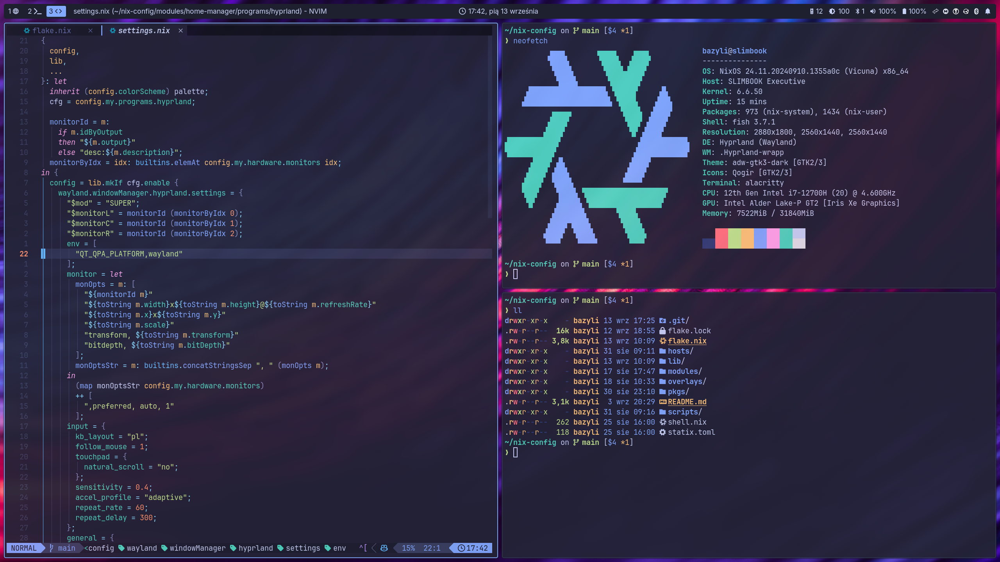
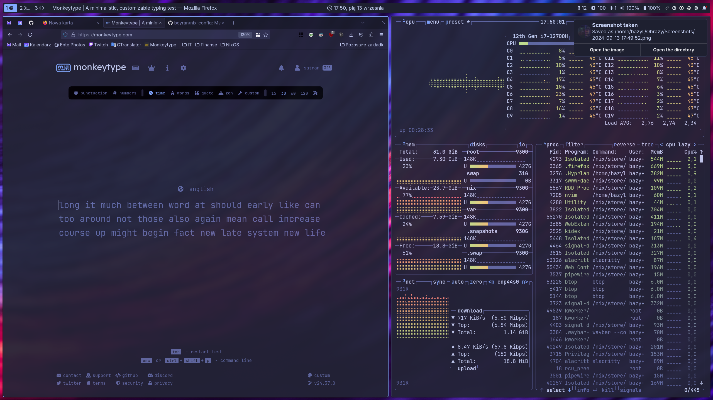

# nix-config

My NixOS and Home Manager config.

## Features

- Declarative disk partitioning with [disko](https://github.com/nix-community/disko).
- LUKS full disk encryption and auto unlocking with TPM.
- Secure Boot with [Lanzaboote](https://github.com/nix-community/lanzaboote).
- BTRFS with home directory snapshots.
- Secrets provisioning with [sops-nix](https://github.com/Mic92/sops-nix).
  The secrets are stored in a separate, private repo.
- The entire configuration is modularized and exported from the flake.
  This allows using selected (or all) parts in other flakes.

## Screenshots





## Installation

> [!WARNING]
> Installation instruction is outdated due to introduction of sops-nix managed secrets.
> I will update it once I figure it out myself.

### System

1. Boot the installer ISO.
2. `cd` into this repo and run `nix-shell`.
3. Run:

   ```shell
   ./scripts/disko-secureboot-install.sh ${hostname} ${username}
   ```

4. Follow the instructions. You will be asked for disk encryption password and root password.
5. Shut down the machine once the installation is completed.

### Secure Boot and TPM

1. Boot into the UEFI interface and setup Secure Boot:
   - Enable Secure Boot.
   - Erase all keys.
   - Enable setup mode.
2. Reboot into NixOS.
3. Login to TTY as root.
4. `cd` into `/home/${username}/nixos-config` and run `nix-shell`.
5. Enroll the Secure Boot keys:

   ```shell
   sbctl enroll-keys --microsoft
   ```

6. Setup LUKS auto decryption using key stored in TPM:

   ```shell
   systemd-cryptenroll --tmp2-device=auto --tpm2-pcrs=0+2+7+12 --wipe-slot=tpm2 ${partition}
   ```

   Enter the passphrase when prompted.

7. Reboot. The disk should be decrypted automatically.

### Home Manager

1. Login as root.
2. Set the user's password: `passwd ${username}`. Enter the new password twice when prompted.
3. Log out and login as the `${username}`.
4. Run `cd nixos-config` and `nix-shell`.
5. Build and switch into Home Manager configuration:

   ```shell
   home-manager switch --flake .
   ```

## Credits & resources

I used this to learn about NixOS and might have copied some stuff from there.

### Configs

- [Misterio77/nix-starter-configs](https://github.com/Misterio77/nix-starter-configs)
- [Misterio77/nix-config](https://github.com/Misterio77/nix-config)
- [fufexan/dotfiles](https://github.com/fufexan/dotfiles)
- [jnsgruk/nixos-config](https://github.com/jnsgruk/nixos-config)
- [EmergentMind/nix-config](https://github.com/EmergentMind/nix-config)
- [hlissner/dotfiles](https://github.com/hlissner/dotfiles)
- [gvolpe/nix-config](https://github.com/gvolpe/nix-config)
- [pinpox/nixos](https://github.com/pinpox/nixos)

### Posts & videos

- [Secure Boot & TPM-backed Full Disk Encryption on NixOS](https://jnsgr.uk/2024/04/nixos-secure-boot-tpm-fde/)
- [NixOS Secrets Management](https://unmovedcentre.com/posts/secrets-management/)
- [Framework and NixOS - Sops-nix Secrets Management](https://0xda.de/blog/2024/07/framework-and-nixos-sops-nix-secrets-management/#re-enabling-secure-boot)
- [Vimjoyer on YT](https://www.youtube.com/@vimjoyer)
- [EmergentMind on YT](https://www.youtube.com/@Emergent_Mind)
